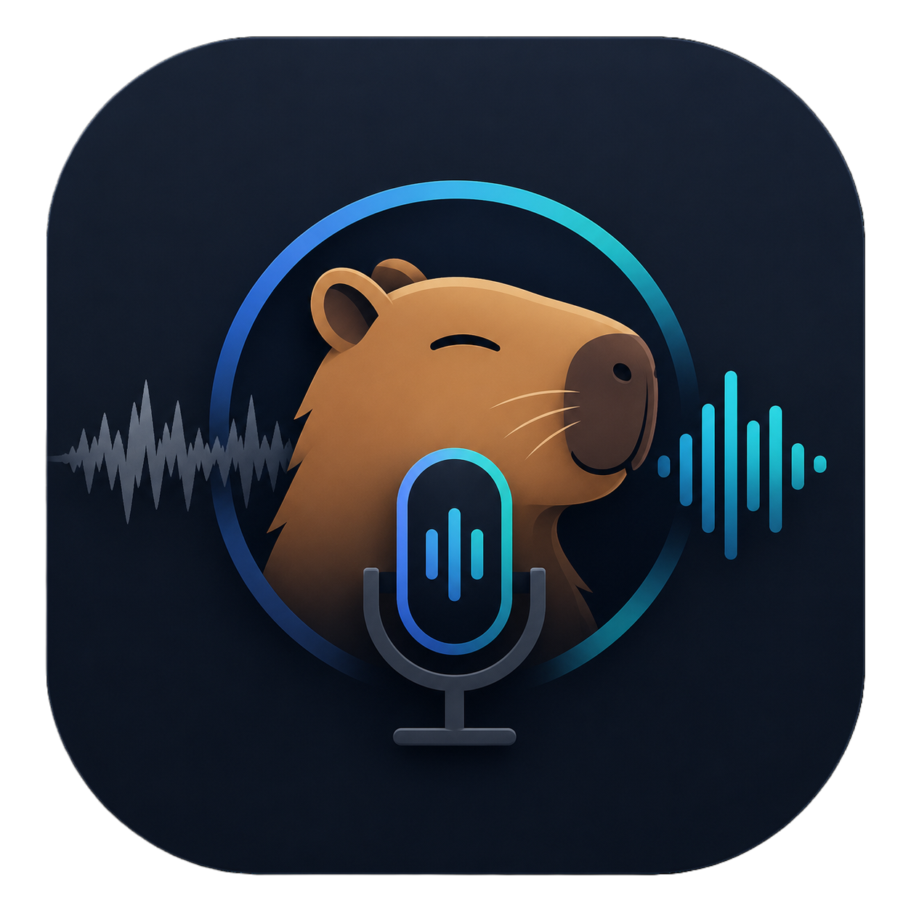
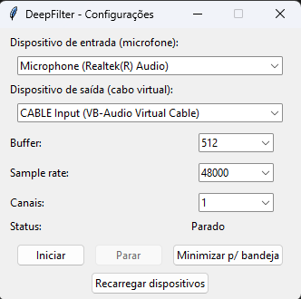

<p align="center">
  
</p>

<h1 align="center">CapyMic</h1>

Real-time microphone noise suppression using the [DeepFilterNet-VST](https://github.com/Rygtx/DeepFilterNet-VST) plugin — a VST2/VST3 build of [DeepFilterNet](https://github.com/Rikorose/DeepFilterNet) — routed through a virtual audio cable so any app (Discord, Zoom, OBS, games, etc.) receives a cleaned-up microphone signal.

The audio is captured from your physical microphone, processed in real time by the DeepFilterNet VST3 plugin (via [Pedalboard](https://github.com/spotify/pedalboard)), and streamed out to a virtual audio cable that other applications can pick up as their microphone input.

## Features

- Real-time AI noise suppression on your microphone using DeepFilterNet.
- Runs quietly in the system tray.
- GUI to pick input/output devices, buffer size, sample rate, and channel count (no need to edit code).
- Saved preferences — your settings are remembered the next time you open the app.
- Distributed as a single, portable `.exe` — no Python installation required.

## Project structure

| File         | Purpose                                                                                     |
|--------------|-----------------------------------------------------------------------------------------------|
| `engine.py`  | Core audio engine: loads the VST3 plugin and manages the `AudioStream` (input → DSP → output). |
| `main.py`    | Runs the same way as the original script — background tray app with hardcoded device names, useful for development/debugging. |
| `app.py`     | Graphical interface (Tkinter) to choose devices/buffer/sample rate and start/stop processing. This is what gets compiled into the released `.exe`. |
| `config.py`  | Saves/loads user preferences (selected devices, buffer size, etc.) to `%APPDATA%\CapyMic\settings.json`. |

## Requirements

### If you just want to use the app (recommended)

- Windows 10/11.
- The `.exe` from the [Releases](../../releases) page — no Python needed.
- A virtual audio cable installed (see guide below).

### If you want to run/build from source

- Python 3.10+ (64-bit).
- Dependencies:
  ```bash
  pip install pedalboard pystray pillow pyinstaller
  ```
- The DeepFilterNet VST3 plugin, built from [Rygtx/DeepFilterNet-VST](https://github.com/Rygtx/DeepFilterNet-VST) (a JUCE-based VST2/VST3 wrapper around the upstream `Rikorose/DeepFilterNet` / `libDF` runtime). You can either:
  - Download a prebuilt `DeepFilterNet-vX.Y.Z-windows.zip` from that project's [Releases](https://github.com/Rygtx/DeepFilterNet-VST/releases) page, or
  - Build it yourself following that repo's instructions (requires CMake, MSVC Build Tools, and the Rust toolchain).

  Either way, extract/place it so the final path matches:
  ```
  ./PluginDeepFilter/DeepFilterNet-v2026.4.2.1-windows/VST3/DeepFilterNet.vst3/Contents/x86_64-win/DeepFilterNet.vst3
  ```
  (relative to the project root — same folder as `engine.py`, `app.py`, `main.py`). If you're using a different plugin version, update `DEFAULT_PLUGIN_PATH` in `engine.py` accordingly.

## Setting up the virtual audio cable

A virtual audio cable is what lets this app "inject" the cleaned-up microphone signal into other programs, as if it were a real microphone. This app sends its **output** to the virtual cable's **input**, and other apps (Discord, Zoom, etc.) pick up the virtual cable's **output** as their microphone.

### Option A: VB-Audio Virtual Cable (recommended, free)

1. Download it from the official site: https://vb-audio.com/Cable/
2. Extract the ZIP and run `VBCABLE_Setup_x64.exe` **as Administrator**.
3. Click **Install Driver**, then **restart your computer** when prompted (required for Windows to register the new audio device).
4. After rebooting, open Windows **Sound settings** and confirm you now see:
   - **CABLE Input (VB-Audio Virtual Cable)** — this appears as a playback/output device.
   - **CABLE Output (VB-Audio Virtual Cable)** — this appears as a recording/input device.
5. In this app's GUI:
   - **Input device** → your real microphone (e.g. `Microphone (Realtek(R) Audio)`).
   - **Output device** → `CABLE Input (VB-Audio Virtual Cable)`.
6. In Discord / Zoom / OBS / your game, set the **microphone/input device** to `CABLE Output (VB-Audio Virtual Cable)`.

That's it — the app reads your real mic, cleans the audio, and "plays" it into the cable; other apps then listen to the cable as if it were a microphone.

### Option B: VoiceMeeter (more advanced routing/mixing)

If you need more control (multiple sources, mixing, EQ, etc.), you can use [VoiceMeeter](https://vb-audio.com/Voicemeeter/) instead:

1. Download and install VoiceMeeter (Banana or Potato, depending on how many inputs you need), restart when prompted.
2. In this app's GUI, set **Output device** to `Voicemeeter Input (VB-Audio Voicemeeter VAIO)`.
3. In VoiceMeeter, route that virtual input to your desired output/mix.
4. In Discord/Zoom/etc., select the corresponding VoiceMeeter output (e.g. `Voicemeeter Out B1`) as your microphone.

VoiceMeeter is more powerful but has a steeper learning curve; VB-Cable is simpler and enough for most users.

> **Tip:** Device names can vary slightly between machines/driver versions. Use the dropdowns in the app (or the "Reload devices" button) to pick the exact names shown on your system rather than assuming the examples above.

## Using the app (from the release `.exe`)

<p align="center">
  
</p>

1. Download and install a virtual audio cable (see above) and restart your PC.
2. Download the latest `.exe` from the [Releases](../../releases) page and run it.
   - Windows SmartScreen may warn about an unrecognized publisher since the app isn't code-signed — click **More info → Run anyway**.
3. In the window that opens:
   - Choose your **microphone** as the input device.
   - Choose your **virtual cable input** (e.g. `CABLE Input (VB-Audio Virtual Cable)`) as the output device.
   - Adjust **buffer size** if you experience latency or audio glitches (lower = less latency but more CPU/risk of glitches; higher = more stable but more delay). `512` is a good starting point.
   - Set **sample rate** and **channels** to match your microphone (mono/1 channel is typical for voice).
4. Click **Start**. Status should change to "Running".
5. In your target app (Discord, Zoom, game, etc.), select the virtual cable's output as the microphone.
6. Click **Minimize to tray** to keep it running in the background. Right-click the tray icon to reopen the window or quit.

Your selections are saved automatically and will be pre-filled the next time you open the app.

## Running from source (development)

```bash
# Background tray app with hardcoded device names (same as the original script)
python main.py

# GUI app with device/buffer selection
python app.py
```

Edit the `MIC_NAME` / `CABLE_NAME` constants in `main.py` if you use it for quick local testing without the GUI.

## Building the `.exe`

The GUI (`app.py`) is meant to be packaged as a single portable executable with the VST3 plugin embedded:

```bash
pyinstaller --onefile --windowed --name CapyMic ^
    --add-data "PluginDeepFilter;PluginDeepFilter" ^
    app.py
```

Notes:
- `--add-data SOURCE;DEST` uses `;` on Windows (`:` on Linux/macOS).
- This bundles the entire `PluginDeepFilter` folder (including the `.vst3`) inside the executable; at runtime, `engine.resource_path()` locates these files in PyInstaller's temporary extraction folder.
- `engine.py` and `config.py` don't need to be added manually — PyInstaller automatically follows the `import engine` / `import config` statements.
- `--windowed` prevents a console window from opening alongside the GUI.
- The resulting file will be at `dist/CapyMic.exe`.

## Troubleshooting

- **"Não foi possível listar dispositivos" / can't list devices**: make sure no other exclusive-mode application is locking your audio devices, and that your audio drivers are up to date.
- **No sound reaches Discord/Zoom**: double-check that the app's *output* is the virtual cable's *input* side, and that the other app's microphone is set to the virtual cable's *output* side — these are two different devices with similar names.
- **Crackling / glitchy audio**: increase the buffer size (e.g. from `256` to `512` or `1024`).
- **High latency**: decrease the buffer size, close CPU-heavy background apps, or check that DeepFilterNet isn't running at a much higher sample rate than needed.
- **App won't start / plugin fails to load**: confirm the `PluginDeepFilter` folder sits next to the `.exe` (if you built without `--add-data`) or was properly embedded (if using the suggested PyInstaller command).

## Credits

- [DeepFilterNet-VST](https://github.com/Rygtx/DeepFilterNet-VST) by Rygtx — the VST2/VST3 plugin used for noise suppression, licensed under **AGPL-3.0**.
- [DeepFilterNet](https://github.com/Rikorose/DeepFilterNet) by Rikorose — the underlying speech-enhancement model/runtime (`libDF`) that the plugin wraps.
- [Pedalboard](https://github.com/spotify/pedalboard) by Spotify — used to load the VST3 plugin and stream audio in Python.
- [VB-Audio Cable / VoiceMeeter](https://vb-audio.com/) — virtual audio device used to route the processed microphone into other apps.

